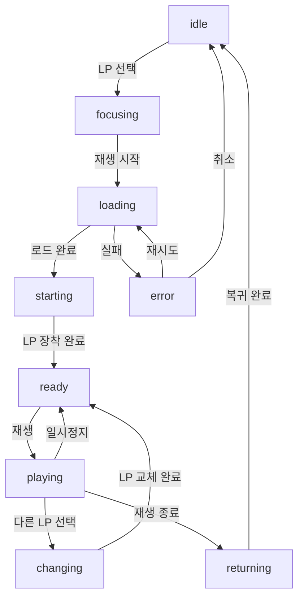

# MyVinyls 애니메이션 상태 정의

## 상태 목록

### 1. idle
- **설명**: 어떤 앨범도 선택되지 않은 초기 상태
- **카메라**: 전체 선반이 보이는 기본 위치
- **인터랙션**: LP 선택 가능
- **UI**: 기본 UI만 표시

### 2. focusing
- **설명**: 앨범을 선택해 빌보드가 활성화된 상태
- **카메라**: 선택된 LP를 중심으로 확대
- **인터랙션**: 재생 시작 또는 다른 LP 선택 가능
- **UI**: 앨범 정보 빌보드 활성화

### 3. loading
- **설명**: YouTube 영상 로드 중인 상태
- **카메라**: focusing 상태와 동일
- **인터랙션**: 제한됨
- **UI**: 로딩 인디케이터 표시

### 4. starting
- **설명**: LP가 플레이어로 이동하는 상태
- **카메라**: LP 이동을 따라가는 부드러운 전환
- **인터랙션**: 제한됨
- **UI**: 진행 상태 표시

### 5. ready
- **설명**: LP가 플레이어에 장착된 상태
- **카메라**: 플레이어 중심의 재생 준비 위치
- **인터랙션**: 재생/일시정지/정지 가능
- **UI**: 플레이어 컨트롤 표시

### 6. playing
- **설명**: 음악이 재생되며 LP가 회전하는 상태
- **카메라**: 플레이어 중심의 재생 위치
- **인터랙션**: 재생 제어 가능
- **UI**: 재생 진행바, 컨트롤 표시
- **애니메이션**: LP 회전, 진행바 업데이트

### 7. changing
- **설명**: 재생 중 다른 앨범으로 변경하는 상태
- **카메라**: 현재 LP가 빠지고 새 LP가 장착되는 과정 추적
- **인터랙션**: 제한됨
- **UI**: 변경 진행 상태 표시

### 8. returning
- **설명**: 재생 종료 후 LP가 선반으로 돌아가는 상태
- **카메라**: LP의 복귀 경로 추적
- **인터랙션**: 제한됨
- **UI**: 진행 상태 표시

### 9. error
- **설명**: 재생 실패 등 오류 발생 상태
- **카메라**: 현재 위치 유지
- **인터랙션**: 재시도 또는 다른 LP 선택 가능
- **UI**: 오류 메시지 표시

## 상태 전환 흐름

## 주의사항

1. 각 상태 전환 시 부드러운 애니메이션을 위해 적절한 `smoothTime` 설정 필요
2. 상태 전환 중에는 사용자 인터랙션 제한하여 안정성 확보
3. 오류 발생 시 적절한 복구 흐름 제공
4. 모든 상태에서 기본적인 UI 반응성 유지
